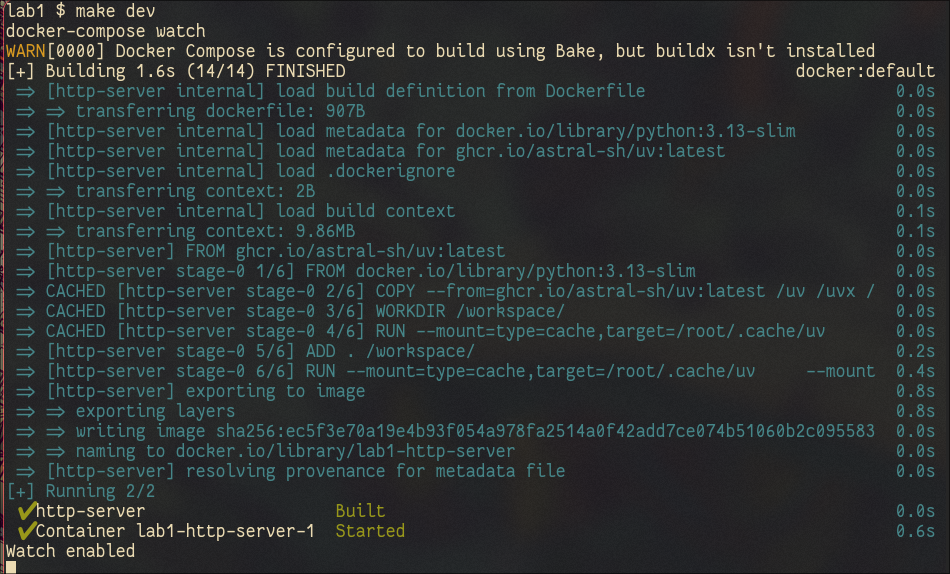
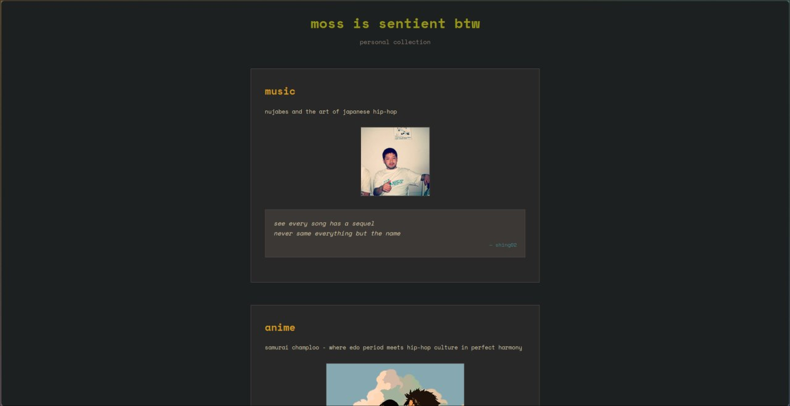
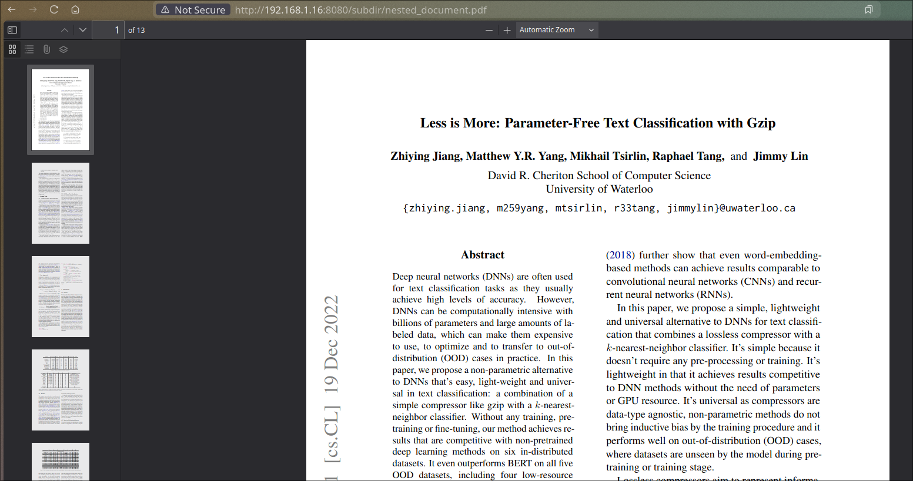
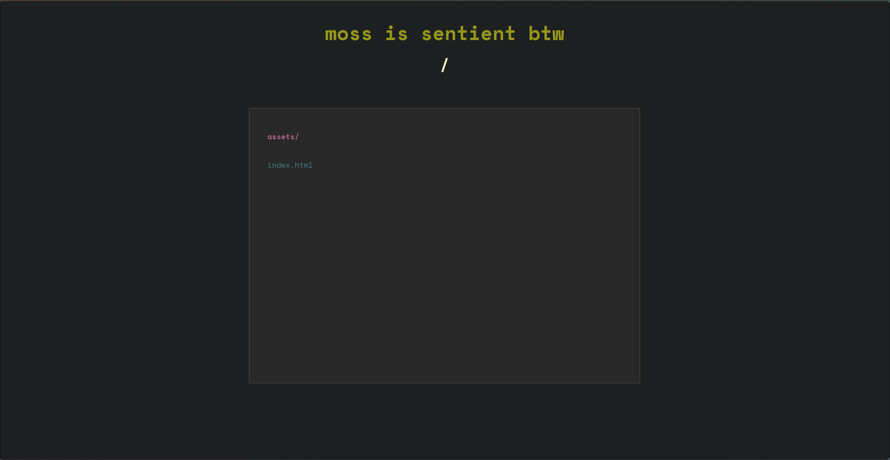
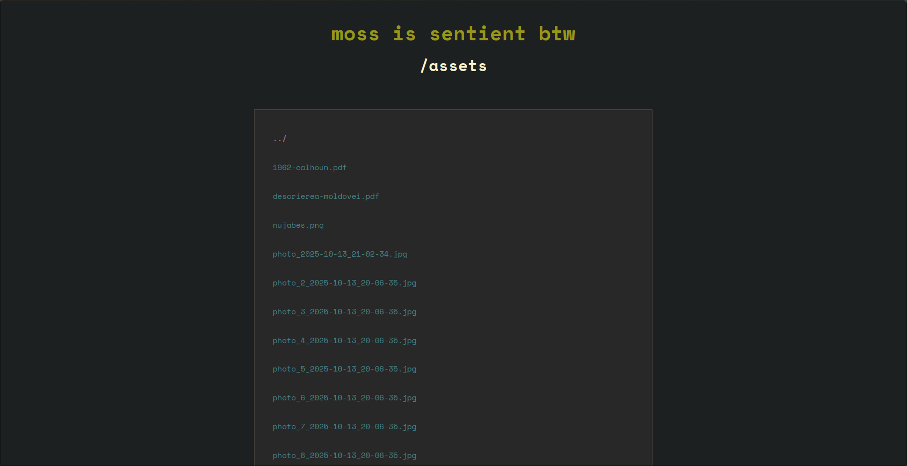

# Lab 1: HTTP File Server

HTTP file server using Python TCP sockets with directory listing and file download capabilities.

### 1. Source Directory Contents

```
src/
└── lab1/
    ├── __init__.py
    ├── client.py
    └── server.py
```

The source directory contains the HTTP server and client implementations.

### 2. Docker Configuration

```yaml
# docker-compose.yml and Dockerfile
```

Docker compose file defines the HTTP server service with volume mounts and port exposure. Dockerfile uses uv cache mounts to speed up dependency installation.

### 3. Starting the Container



Container starts in watch mode with HTTP server service.

### 5. Using uv

```bash
uv run server www/ 8080
uv run client 0.0.0.0 8080 index.html
```

Both server and client can be run by uv directly

### 6. Served Directory Contents

```
www/
├── index.html
├── sample.png
├── document1.pdf
├── document2.pdf
└── subdir/
    ├── index.html
    ├── nested_image.png
    └── nested_document.pdf
```

The www directory contains HTML files, images, and PDFs for serving.

### 7. Browser Requests


404 error page for non-existent files.



HTML file with embedded image displayed in browser.



PDF file serving and download functionality.


PNG image file serving and display.

### 8. Client Implementation

The client downloads files and displays output with saved files handling.

### 9. Directory Listing



Directory listing page for root directory.



Directory listing page for subdirectory navigation.
