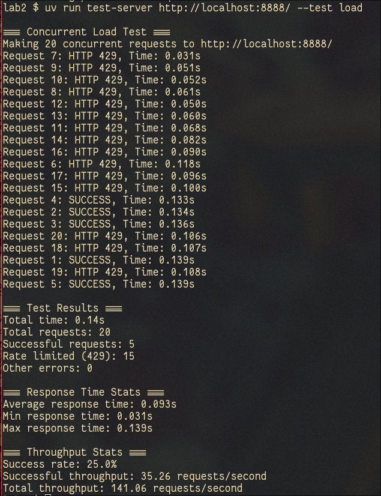
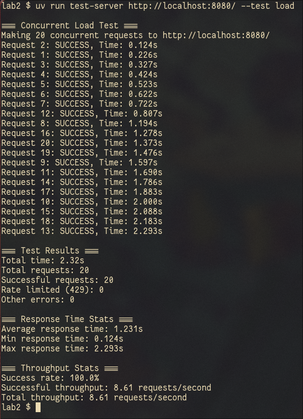
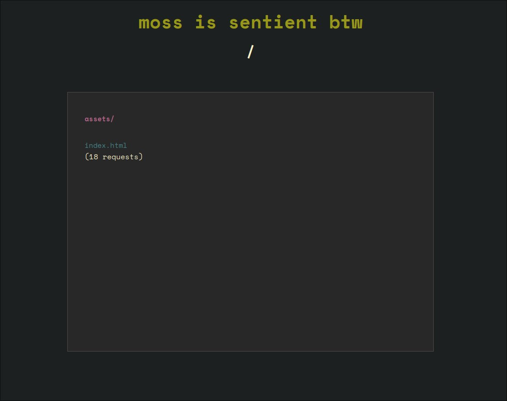
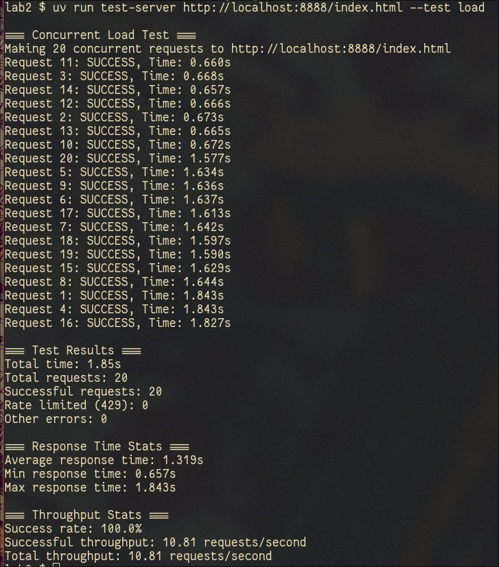
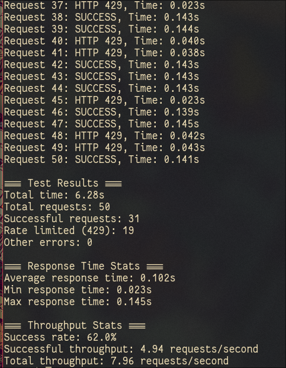

# Lab 2: Concurrent HTTP Server

Multithreaded HTTP file server implementation that handles multiple concurrent connections using Python threading. The server demonstrates concurrency concepts, race conditions, thread safety, and rate limiting mechanisms.

## Project Structure

```
lab2/
├── src/lab2/
│   ├── __init__.py           # Package initialization
│   ├── server.py            # Concurrent HTTP server implementation
│   └── test_server.py       # Performance testing script
├── img/                     # Screenshots for report
├── .env                     # Environment configuration
├── Dockerfile              # Docker image configuration
├── docker-compose.yml      # Service orchestration
├── Makefile                # Development workflow automation
└── pyproject.toml          # Python package configuration with uv
```

## Docker Configuration

#### Environment Variables (.env)

```env
# Server basics
HTTP_DIRECTORY=/workspace/packages/www
HTTP_PORT=8080

# Performance settings
HTTP_RATE_LIMIT=5
HTTP_DELAY=0.1
HTTP_LISTEN_QUEUE=5

# Development/testing options
HTTP_UNSAFE_COUNTING=false
HTTP_NO_DELAY=false

# For race condition demonstration:
# HTTP_UNSAFE_COUNTING=true
# HTTP_DELAY=0.5
```

#### Dockerfile

```dockerfile
FROM python:3.13-slim
COPY --from=ghcr.io/astral-sh/uv:latest /uv /uvx /bin/
WORKDIR /workspace/

RUN --mount=type=cache,target=/root/.cache/uv \
    --mount=type=bind,source=uv.lock,target=/workspace/uv.lock \
    --mount=type=bind,source=pyproject.toml,target=/workspace/pyproject.toml \
    --mount=type=bind,source=packages/,target=/workspace/packages/ \
    uv sync --locked --no-install-project

ADD . /workspace/

RUN --mount=type=cache,target=/root/.cache/uv \
    --mount=type=bind,source=uv.lock,target=/workspace/uv.lock \
    --mount=type=bind,source=pyproject.toml,target=/workspace/pyproject.toml \
    --mount=type=bind,source=packages/lab2/pyproject.toml,target=/workspace/packages/lab2/pyproject.toml \
    uv sync --locked

CMD ["uv", "run", "./packages/lab2/src/lab2/server.py"]
```

#### Docker Compose

```yaml
services:
  concurrent-server:
    build:
      context: ../..
      dockerfile: packages/lab2/Dockerfile
    develop:
      watch:
        - action: sync
          path: .
          target: /workspace
          ignore:
            - .venv/
        - action: rebuild
          path: ./pyproject.toml
    network_mode: host
    env_file:
      - .env
    volumes:
      - ../www:/workspace/packages/www
    command: ["uv", "run", "./packages/lab2/src/lab2/server.py"]
```

**Network Configuration:**
- Host networking for direct access to host network interfaces
- Environment file loads configuration from `.env` into container
- Volume mounting serves files from `../www` directory

## Starting the Container

```bash
# Start development environment with file watching
make dev

# Start server in background
make server

# View server logs
make logs
```

## Server Implementation Features

### Core Functionality
- **Multithreaded Architecture** - Creates a new thread for each client request
- **Concurrent Request Handling** - Multiple clients can connect simultaneously
- **Thread-safe Operations** - Uses locks for shared data structures
- **Rate Limiting** - Per-client IP rate limiting (configurable RPS)
- **Request Counting** - Tracks number of requests per file with race condition demonstration

### Configuration Options

The server supports both command-line arguments and environment variables:

```bash
# Using environment variables (recommended for Docker)
docker compose up

# Using command-line arguments
uv run server.py ./www 8080 --rate-limit 10 --delay 0.5

# Race condition demonstration
uv run server.py ./www 8080 --unsafe-counting --delay 0.5
```

**Available Options:**
- `--rate-limit N` - Requests per second per IP (default: 5)
- `--unsafe-counting` - Disable thread-safe counting (shows race conditions)
- `--delay SECONDS` - Artificial delay per request (default: 0.1s)
- `--no-delay` - Disable artificial delay
- `--listen-queue N` - Socket listen queue size (default: 5)

## Performance Testing

### Concurrent Request Testing Script

The test script (`test_server.py`) compares single-threaded vs multithreaded performance:

```bash
# Run performance comparison
uv run test_server.py

# Test with custom parameters
uv run test_server.py --requests 20 --url http://localhost:8080/assets/computer-networks.pdf
```

### Single-threaded Server Performance



Single-threaded server from Lab 1 processes requests sequentially. 20 concurrent requests take approximately 2+ seconds total time.

### Multi-threaded Server Performance



Multi-threaded server processes requests concurrently. 20 concurrent requests complete in approximately 0.1 seconds.

**Performance Comparison:**
- **Single-threaded**: Sequential processing, higher total time
- **Multithreaded**: Parallel processing, significantly lower total time
- **Throughput**: Multi-threaded server achieves much higher requests per second

## Request Counter Feature (2 points)

### Race Condition Demonstration



When `HTTP_UNSAFE_COUNTING=true`, the server demonstrates race conditions. The request count shown is lower than the actual number of requests made due to lost updates.

```bash
# Enable unsafe counting to show race conditions
docker compose down
# Edit .env: HTTP_UNSAFE_COUNTING=true, HTTP_DELAY=0.5
docker compose up
```

**Race Condition Scenario:**
1. Multiple threads read the same counter value
2. Each increments the local copy
3. Threads write back the incremented value
4. Final count is less than actual requests due to lost updates

### Thread-Safe Implementation



With `HTTP_UNSAFE_COUNTING=false` (default), the server uses thread-safe counting. All requests are accurately counted and displayed.

```python
def increment_request_count_safe(self, file_path):
    with self.request_lock:
        self.request_counts[file_path] += 1
```

**Thread Safety Mechanism:**
- Uses `threading.Lock()` for mutual exclusion
- Atomic increment operations
- Prevents lost updates and data races
- Guarantees accurate request counting

## Rate Limiting Feature (2 points)

### Thread-Safe Rate Limiting



The server implements per-client IP rate limiting at 5 requests per second. Requests exceeding the rate limit receive HTTP 429 "Too Many Requests" responses.

```python
def check_rate_limit(self, client_ip):
    current_time = time.time()
    with self.rate_limit_lock:
        # Clean old requests (older than 1 second)
        self.rate_limit_data[client_ip] = [
            timestamp for timestamp in self.rate_limit_data[client_ip]
            if current_time - timestamp < 1.0
        ]
        
        # Check if rate limit exceeded
        if len(self.rate_limit_data[client_ip]) >= self.requests_per_second:
            return False
            
        # Add current request
        self.rate_limit_data[client_ip].append(current_time)
        return True
```

### Rate Limiting Testing

**Test Scenario:**
1. **Client A** - Sends requests above rate limit (>5 RPS)
2. **Client B** - Sends requests below rate limit (<5 RPS)

**Results:**
- Client A receives HTTP 429 responses for excess requests
- Client B's requests are processed normally
- Rate limiting is applied per IP address independently

## Concurrency Concepts

### Thread Creation

The server creates a new thread for each client connection:

```python
client_thread = threading.Thread(
    target=self.handle_client, args=(client_socket, address)
)
client_thread.daemon = True
client_thread.start()
```

### Synchronization Mechanisms

**Used Synchronization Primitives:**
1. **Request Counter Lock** - `threading.Lock()` for request counting
2. **Rate Limit Lock** - Separate lock for rate limiting data
3. **Atomic Operations** - Thread-safe timestamp management

### Race Condition Analysis

**Unsafe Implementation:**
```python
def increment_request_count(self, file_path):
    current_count = self.request_counts[file_path]  # Read
    time.sleep(0.0001)  # Simulate work/delay
    self.request_counts[file_path] = current_count + 1  # Write
```

**Thread-Safe Implementation:**
```python
def increment_request_count_safe(self, file_path):
    with self.request_lock:
        self.request_counts[file_path] += 1
```

## Development Workflow

### Makefile Commands

```bash
make dev          # Start development with file watching
make server       # Start server in background
make test         # Run performance tests
make logs         # View server logs
make status       # Check service status
make stop         # Stop all services
make clean        # Clean up containers
```

### Environment Configuration

```bash
# Development mode (no delay, safe counting)
HTTP_NO_DELAY=true
HTTP_UNSAFE_COUNTING=false

# Race condition demo mode
HTTP_DELAY=0.5
HTTP_UNSAFE_COUNTING=true

# Performance testing mode
HTTP_RATE_LIMIT=10
HTTP_DELAY=0.1
```

## Implementation Details

### HTTPServer Class Enhancements

**New Features in Lab 2:**
- Thread-per-request architecture
- Request counting with race condition toggle
- Rate limiting by client IP
- Configurable delays for testing
- Thread-safe data structures

**Threading Model:**
- Main thread accepts connections
- Worker threads handle individual requests
- Daemon threads for automatic cleanup
- Synchronization with locks for shared state

### Performance Characteristics

**Throughput Improvements:**
- Concurrent request processing
- Non-blocking I/O for multiple clients
- Scalable thread management
- Resource-aware rate limiting

---

*Built with Python 3.13 threading, TCP sockets, uv package manager, and Docker containerization*