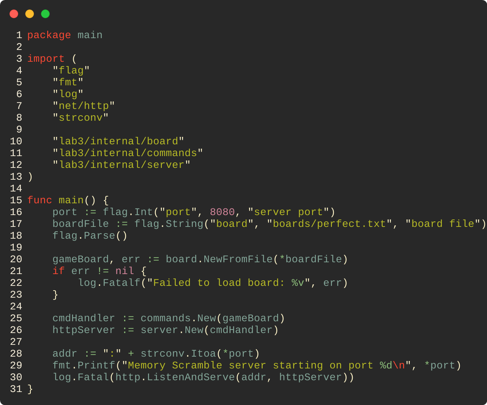
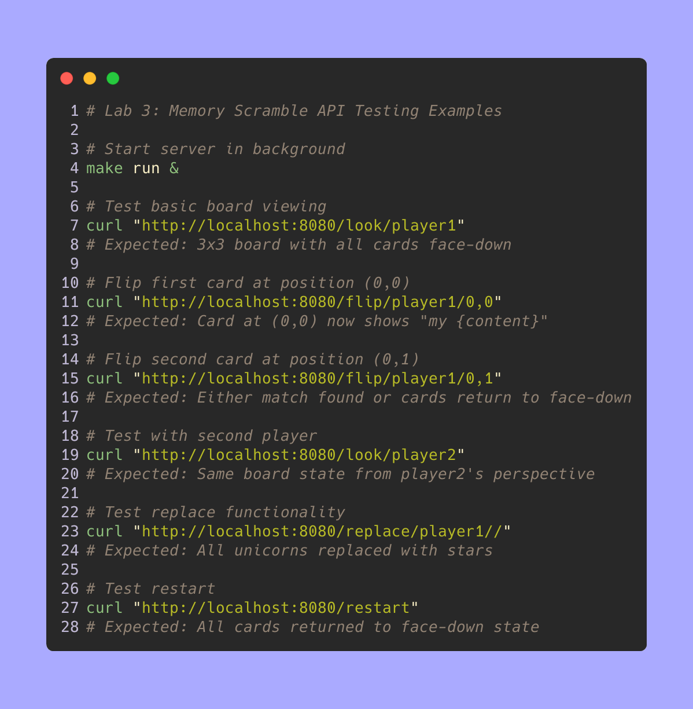
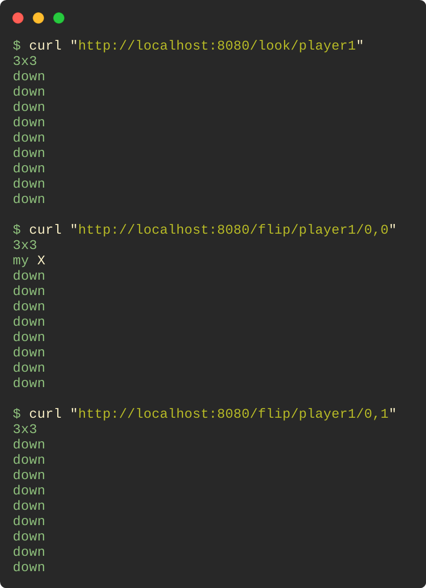
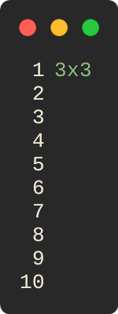
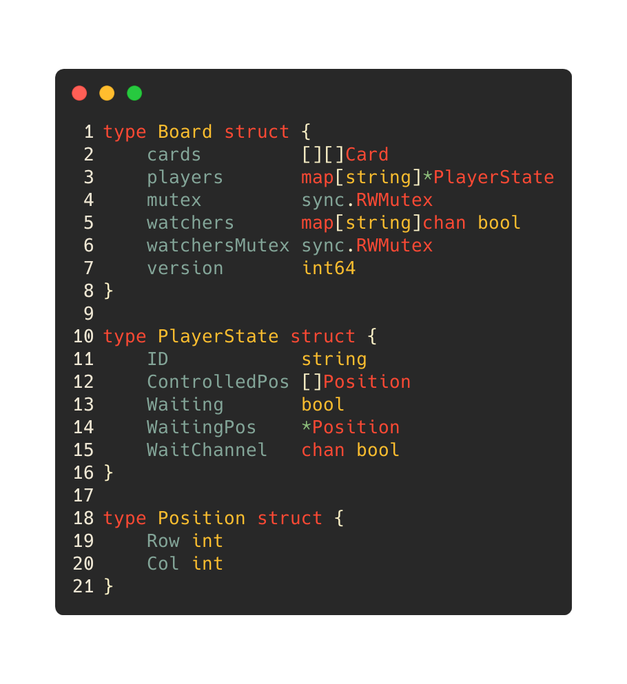

# Lab 3: Memory Scramble - Concurrent Game Server

A multi-player Memory Scramble game server implemented in Go, featuring concurrent gameplay, thread-safe operations, and a web-based user interface. This implementation follows the MIT 6.102 Problem Set 4 specification.

## Project Structure

```
lab3/
├── internal/
│   ├── board/              # Core game board ADT
│   │   └── board.go        # Memory Scramble game logic with thread safety
│   ├── commands/           # API command layer  
│   │   └── commands.go     # HTTP command interface to board operations
│   └── server/             # HTTP server implementation
│       └── server.go       # Web server with CORS and routing
├── test/
│   └── board_test.go       # Comprehensive test suite (25+ test cases)
├── cmd/simulation/         # Simulation and testing utilities
│   └── main.go             # Game simulation script
├── boards/
│   └── perfect.txt         # Sample game board configuration
├── main.go                 # Main server application
├── index.html              # Web-based game client interface
├── Makefile                # Build and development commands
└── go.mod                  # Go module definition
```

## Memory Scramble Game Rules

The game implements all rules from the MIT 6.102 PS4 specification:

### Rule 1: First Card Flip
- **1-A**: Cannot flip position with no card
- **1-B**: Face-down card becomes face-up and controlled by player
- **1-C**: Face-up uncontrolled card becomes controlled by player  
- **1-D**: Face-up controlled card requires waiting for availability

### Rule 2: Second Card Flip  
- **2-A**: Flipping empty position relinquishes control of first card
- **2-B**: Flipping controlled card relinquishes control of first card
- **2-C**: Face-down card becomes face-up
- **2-D**: Matching cards remain controlled by player
- **2-E**: Non-matching cards trigger next move processing

### Rule 3: Move Processing
- **3-A**: Matching cards are removed from the board
- **3-B**: Non-matching cards return to face-down state

## Quick Start

### Prerequisites
- Go 1.25+ installed
- Web browser for the game interface

The main server architecture follows a clean three-layer design:



### Playing the Game

1. **Start the Server**: `make run` (default port 8080)
2. **Open Web Interface**: Navigate to `http://localhost:8080`
3. **Connect**: Enter server address and click "play!"
4. **Play**: Click cards to flip, wait for matches, use replace feature

### Game Client Modes
- **Polling Mode**: Periodically checks for board updates
- **Watching Mode**: Uses long-polling for real-time updates

## HTTP API Endpoints

All endpoints return board state in the specified format: `ROWxCOL\n` followed by card states.

### Core Game Operations

```http
GET /look/{playerID}
```
Returns current board state from player's perspective.

```http  
GET /flip/{playerID}/{row},{col}
```
Attempts to flip card at specified position.

```http
GET /watch/{playerID}
```
Long-polling endpoint that waits for board changes.

### Advanced Operations

```http
GET /replace/{playerID}/{fromCard}/{toCard}
```
Replaces all instances of `fromCard` with `toCard` content.

```http
GET /restart
```
Resets board to initial state, all cards face-down.

### Response Formats

**Successful Response:**
```
2x3
down
up apple
my banana
none
down
my apple
```

**Card States:**
- `none` - Empty position (no card)
- `down` - Face-down card
- `up {content}` - Face-up card controlled by another player
- `my {content}` - Face-up card controlled by this player

### API Testing Examples

You can test the HTTP API directly using curl commands while the server is running:



**Expected API Responses:**



**Performance Testing:**
```bash
# Test concurrent requests (requires bash)
for i in {1..10}; do
  curl -s "http://localhost:8080/look/player$i" &
done; wait
# All requests should complete successfully with same board state

# Test rapid flipping
curl "http://localhost:8080/flip/player1/0,0"
curl "http://localhost:8080/flip/player1/0,1" 
curl "http://localhost:8080/flip/player1/1,0"
# Should handle rapid sequential requests correctly
```

## Board File Format

Game boards are defined in text files with the following format:

```
ROWSxCOLS
card1_content
card2_content
...
cardN_content
```

**Example Board Format:**



This creates a 3×3 board where cards can be matched (apple-apple, banana-banana, carrot-carrot).

## Development Commands

### Build and Test

```bash
make build          # Build server binary
make test           # Run comprehensive test suite  
make dev-test       # Run tests with verbose output
make format         # Format Go source code
```

### Running and Debugging

```bash
make run            # Start server (default: port 8080, boards/perfect.txt)
make run PORT=9000  # Start on custom port
make simulation     # Run game simulation script
make clean          # Clean build artifacts
```

### Available Makefile Targets

- `build` - Compile server binary as `memory-scramble`
- `test` - Execute full test suite with coverage
- `run` - Start development server (configurable PORT/BOARD)
- `simulation` - Run automated game simulation
- `clean` - Remove build artifacts and temp files
- `format` - Apply Go code formatting standards
- `help` - Display available commands and usage

## Testing Framework

The test suite provides comprehensive coverage of all game mechanics:

### Test Categories

1. **Board Parsing Tests**
   - File format validation
   - Error handling for malformed boards
   - Dimension and content verification

2. **Game Rules Tests** (MIT 6.102 PS4 Rules)
   - **Rules 1-A through 1-D**: First card flip scenarios
   - **Rules 2-A through 2-E**: Second card flip scenarios  
   - **Rules 3-A and 3-B**: Move processing and card removal

3. **Concurrency Tests**
   - Multi-player simultaneous operations
   - Thread safety validation
   - Waiting and notification mechanisms

4. **API Integration Tests**
   - All HTTP commands through Commands layer
   - Error condition handling
   - Board state consistency

5. **Edge Case Tests**
   - Invalid positions and parameters
   - Large boards and performance
   - Boundary condition validation

### Running Tests

```bash
# Run all tests
make test

# Run with verbose output
make dev-test

# Run specific test functions
go test ./test/... -run TestFlipFirstCard
go test ./test/... -run TestConcurrency
```

## Architecture Details

### Board ADT (Abstract Data Type)

The `board` package implements a complete ADT with proper abstraction function, representation invariant, and thread safety:



**Safety from Rep Exposure:**
- Cards array never returned directly
- Position structs passed by value
- Mutex ensures thread-safe operations
- Player states accessed through controlled methods

### Concurrency Implementation

**Thread Safety Mechanisms:**
- `sync.RWMutex` for board operations (allows concurrent reads)
- Separate `sync.RWMutex` for watcher management
- Atomic operations for version incrementing
- Channel-based player notifications

**Player State Management:**
- Individual player waiting states
- Non-blocking notification channels  
- Automatic cleanup of completed operations
- Timeout handling for abandoned requests

### HTTP Server Architecture

**Three-Layer Design:**
1. **Server Layer** (`server` package): HTTP routing, CORS, request parsing
2. **Commands Layer** (`commands` package): API interface, parameter validation
3. **Board Layer** (`board` package): Core game logic, thread safety

**Benefits:**
- Clean separation of concerns
- Easy testing of individual layers  
- Consistent error handling across endpoints
- Scalable architecture for additional features

## Web Interface Features

### Game Board Display
- **Visual Card States**: Different colors for face-down, face-up, controlled, and waiting cards
- **Click-to-Flip**: Interactive card flipping with visual feedback
- **Real-time Updates**: Choice between polling and watching modes
- **Multi-player Awareness**: Visual indication of cards controlled by other players

### Advanced Features  
- **Card Replacement**: Transform all instances of a card type
- **Game Restart**: Reset board to initial state
- **Server Configuration**: Configurable server address and update mode
- **Error Handling**: Clear error messages and status indicators

### Browser Compatibility
- **CORS Support**: Proper headers for cross-origin requests
- **HTTPS Handling**: Automatic protocol detection and warnings
- **Safari Compatibility**: Special handling for Safari's localhost restrictions
- **Mobile Responsive**: Bootstrap-based responsive design

