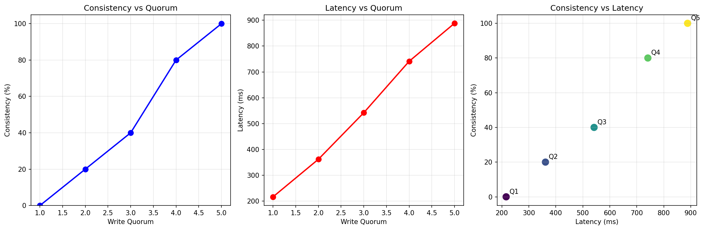

# Distributed Key-Value Store with Leader-Follower Replication

A distributed key-value store implementation with single-leader replication using Docker containers. The system supports both RPC and HTTP APIs with configurable semi-synchronous replication.

## Architecture

- **1 Leader Node**: Accepts all writes and replicates to followers
- **5 Follower Nodes**: Receive replicated writes from the leader
- **Semi-synchronous Replication**: Configurable write quorum (1-5 confirmations required)
- **Network Simulation**: Random delays (0-1000ms) to simulate real network conditions
- **Concurrent Processing**: All operations are handled concurrently

## Features

- **HTTP JSON API**: RESTful endpoints for key-value operations
- **RPC Interface**: Alternative protocol for inter-node communication  
- **Write Quorum**: Configurable number of follower confirmations required
- **Network Delays**: Simulated network latency for realistic testing
- **Docker Deployment**: Complete containerized setup with docker-compose
- **Integration Tests**: Comprehensive testing suite
- **Performance Analysis**: Automated benchmarking tools

## Quick Start

### 1. Start the Cluster

```bash
docker-compose up (configurable via .env)
```

### 2. Test Basic Operations

```bash
# Set a key-value pair
curl -s http://localhost:9000/set --json '{"key": "mykey", "value": "myvalue"}'

# Get a value
curl -s http://localhost:9000/get --json '{"key": "mykey"}'

# Delete a key
curl http://localhost:9000/delete --json '{"key": "mykey"}'
```

### 4. Manage Write Quorum (Leader Only)

```bash
# Check current quorum configuration
curl -s http://localhost:9000/admin/quorum

# Set write quorum to 2 (requires 2 follower confirmations)  
curl -s http://localhost:9000/admin/quorum --json '{"quorum": 2}'

# Set write quorum to 5 (requires all 5 followers to confirm)
curl -s http://localhost:9000/admin/quorum --json '{"quorum": 5}'
```

### 3. Run Integration Test

```bash
# Make sure the cluster is running, then:
./test/integration_test.sh
```

## Performance Analysis

Analyze write quorum performance and consistency using the Python analysis script:

```bash
# Make sure the cluster is running first
docker-compose up -d

# Install Python dependencies (if needed)
pip install requests matplotlib

# Run comprehensive quorum analysis
python analysis.py
```

The analysis tool automatically tests quorum values 1-5, measures write latency, and verifies consistency across all nodes. Results are saved to `analysis_results.png`.

### Analysis Results



The plot shows the trade-off between write latency and consistency:
- **Quorum 1**: Fastest writes (216ms) but no consistency guarantees (0%)  
- **Quorum 2**: Moderate latency (362ms) with basic consistency (20%)
- **Quorum 3**: Balanced approach (542ms) with decent consistency (40%)
- **Quorum 4**: Higher latency (741ms) but strong consistency (80%)
- **Quorum 5**: Slowest writes (888ms) but full consistency (100%)

## Testing

### Integration Tests
```bash
./test/integration_test.sh    # Full end-to-end cluster testing
```

### Unit Tests
```bash
go test ./test/               # Run all unit tests
go test ./test/ -v            # Verbose output
```

## Manual Setup

If you dont want docker
```bash
# Build the application
go build -o kvstore ./cmd/kvstore

# Run leader with all CLI options
./kvstore -id=leader -leader=leader \
  -followers=localhost:8001,localhost:8002,localhost:8003 \
  -commit-threshold=2 -min-delay=0 -max-delay=1000 \
  -rpc-port=:8000 -http-port=:9000

# Run follower
./kvstore -id=follower1 -leader=leader \
  -rpc-port=:8001 -http-port=:9001
```

### CLI Arguments

| Flag | Default | Description |
|------|---------|-------------|
| `-id` | "" | Node identifier |
| `-leader` | "" | Leader node ID |
| `-followers` | "" | Comma-separated follower addresses |
| `-commit-threshold` | 1 | Write quorum size |
| `-min-delay` | 0 | Minimum replication delay (ms) |
| `-max-delay` | 0 | Maximum replication delay (ms) |
| `-rpc-port` | ":8000" | RPC server port |
| `-http-port` | ":9000" | HTTP server port |

## Configuration

Configure the system using environment variables in .env:

| Variable | Default | Description |
|----------|---------|-------------|
| `WRITE_QUORUM` | 3 | Number of follower confirmations required (1-5) |
| `MIN_DELAY` | 0 | Minimum network delay in milliseconds |
| `MAX_DELAY` | 1000 | Maximum network delay in milliseconds |

## Requirements

- Go 1.25.3 or later
- Docker and Docker Compose (for containerized deployment)
- Python 3.x with `requests` and `matplotlib` libraries (for performance analysis)
- jq (for integration tests)

## API Endpoints

### Leader Node (localhost:9000)
- `POST /set` - Set key-value pair
- `POST /get` - Get value by key
- `POST /delete` - Delete key
- `POST /exists` - Check if key exists
- `GET /status` - Health check endpoint
- `GET /admin/quorum` - Get current quorum configuration (leader only)
- `POST /admin/quorum` - Update write quorum (leader only)

### Follower Nodes (localhost:9001-9005)
- Same endpoints as leader, but writes will be rejected unless made from a leader
- Reads are served from local replica

## Quorum API Details

### Get Quorum Status
**Endpoint:** `GET /admin/quorum` (Leader only)

**Response:**
```json
{
  "success": true,
  "data": {
    "current_quorum": 3,
    "max_followers": 5,
    "active_followers": 5
  }
}
```

### Update Write Quorum  
**Endpoint:** `POST /admin/quorum` (Leader only)

**Request:**
```json
{
  "quorum": 2
}
```

**Response:**
```json
{
  "success": true,
  "data": {
    "current_quorum": 2,
    "max_followers": 5,
    "active_followers": 5
  }
}
```

**Valid quorum values:** 1-5 (must not exceed the number of available followers)

## Architecture Details

### Semi-Synchronous Replication

The leader implements semi-synchronous replication where:

1. **Write Operation**: Leader immediately writes to its local store
2. **Concurrent Replication**: Leader sends write requests to all followers concurrently
3. **Random Delays**: Each follower request has a different random delay (MIN_DELAY to MAX_DELAY)
4. **Write Quorum**: Leader waits for specified number of confirmations before responding to client
5. **Success Response**: Once quorum is reached, client receives success response

### Network Delay Simulation

Each replication request includes a random delay to simulate real network conditions:
- Delays are randomly generated between MIN_DELAY and MAX_DELAY
- Each follower gets a different delay for concurrent replication testing
- Helps analyze system behavior under various network conditions

### Project Structure

```
lab4/
├── go.mod
├── docker-compose.yml
├── Dockerfile
├── README.md
├── .env
├── analysis.py
├── analysis_results.png         # Generated analysis plot
├── cmd/
│   └── kvstore/
│       └── main.go
├── common/
│   └── types.go
├── follower/
│   ├── store.go
│   └── types.go
├── http/
│   ├── client.go
│   ├── http.go
│   └── types.go
├── kv/
│   └── kv.go
├── leader/
│   └── leader.go
├── rpc/
│   ├── client.go
│   ├── rpc.go
│   └── types.go
├── store/
│   ├── mapstore.go
│   └── store.go
└── test/
    ├── http_test.go
    ├── integration_test.sh
    └── leader_test.go
```
